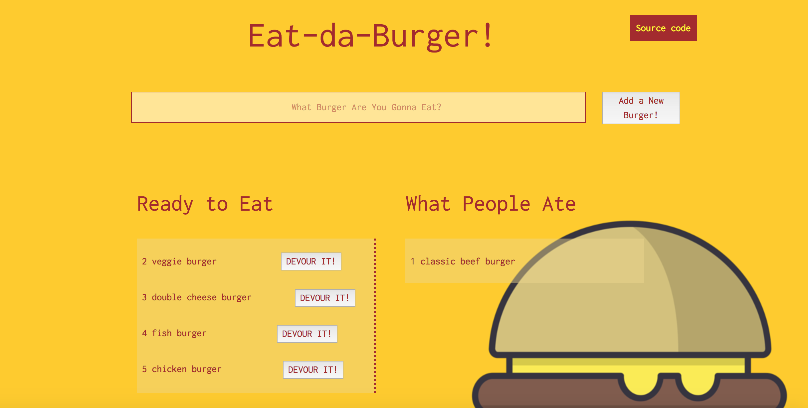

## Eat-da-Burger!

This is a full stack application mimicking restaurant food ordering and tracking application

####Deployed to Heroku at:
[Heroku](https://cryptic-atoll-87312.herokuapp.com/)

### Notable technology:
#####*front-end:
    - handlebars
#####*back-end:
    - Express
    - mySQL database

###Usage
1. On page loading: retrieve all uneaten and eaten burgers stored in database and display;
2. User can enter the name of a burger they would like to eat;
3. New uneaten burger will be stored into database and displayed on corresponding area of the page;
4. When ready to eat: click 'Devour it!' button to notify;
5. Update will be send to database and will be reflected on the page.

###Preview
